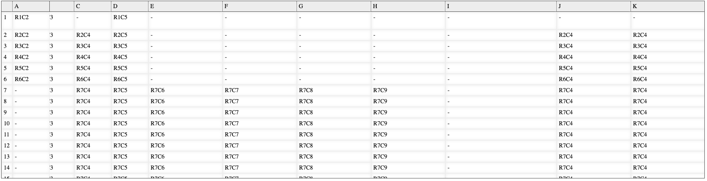

# Advanced React Table

A react table with support for freezing columns and rows.



# INSTALLATION

On node command line type: `npm i @cradlesoft/advanced-react-table` to install

# USAGE

```jsx
import * as React from "react";
import styles from "./App.module.scss";
import rows from "./sample.json";

import Table from "@cradlesoft/advanced-react-table";

function App() {
  const columns = [
    {
      width: 30,
      id: "Column1",
      title: " ",
    },
    {
      width: 100,
      id: "Column2",
      title: "A",
    },
    {
      width: 100,
      id: "Column3",
      title: "B",
    },
    {
      width: 100,
      id: "Column4",
      title: "C",
    },
    {
      width: 100,
      id: "Column5",
      title: "D",
    },
    {
      width: 200,
      id: "Column6",
      title: "E",
    },
    {
      width: 200,
      id: "Column7",
      title: "F",
    },
    {
      width: 200,
      id: "Column8",
      title: "G",
    },
    {
      width: 200,
      id: "Column9",
      title: "H",
    },
    {
      width: 300,
      id: "Column10",
      title: "I",
    },
    {
      width: 200,
      id: "Column4",
      title: "J",
    },
    {
      width: 200,
      id: "Column4",
      title: "K",
    },
    {
      width: 300,
      id: "Column4",
      title: "L",
    },
    {
      width: 200,
      id: "Column4",
      title: "M",
    },
    {
      width: 300,
      id: "Column4",
      title: "N",
    },
  ];

  return (
    <div className={styles.App}>
      <Table
        // hideColumnHeaders
        freezeColumnHeaders
        freezeFirstColumn
        freezeRows={0}
        freezeColumns={1}
        headerRowStyle={{ padding: 5 }}
        cellStyle={{ padding: 5 }}
        cellClass={styles.Cell}
        headerRowClass={styles.Header}
        columns={columns}
        rows={rows}
      />
    </div>
  );
}

export default App;
```

Checkout the full sample code in [codesandbox](https://codesandbox.io/embed/react-compiler-forked-c46lz4?fontsize=14&hidenavigation=1&theme=dark)

# OPTIONS

| Name                | Type                | Default Value | Description                                                          |
| ------------------- | ------------------- | ------------- | -------------------------------------------------------------------- |
| hideColumnHeaders   | boolean             | false         | If true, column headers will not be renadered                        |
| freezeColumnHeaders | boolean             | false         | If true, the row containing the column headers should be frozen.     |
| freezeFirstColumn   | boolean             | false         | If true the first column will be frozen.                             |
| freezeRows          | number              | 0             | The number of rows to freeze in addition to the column header row    |
| freezeColumns       | number              | 0             | The number of columns to freeze                                      |
| headerRowStyle      | React.CSSProperties | false         | CSS style that will be applied to each table cell in the header row. |
| cellStyle           | React.CSSProperties | false         | CSS style that will be applied to other cells in the table.          |
| cellClass           | string              | false         | CSS class that will be added to each cell in the header row.         |
| headerRowClass      | string              | false         | CSS class that will be added to other cells in the table.            |
| columns             | object array        | []            | An array of objects describing the columns of the table.             |
| row                 | object array        | []            | An array of objects containing the actual records of the table.      |
